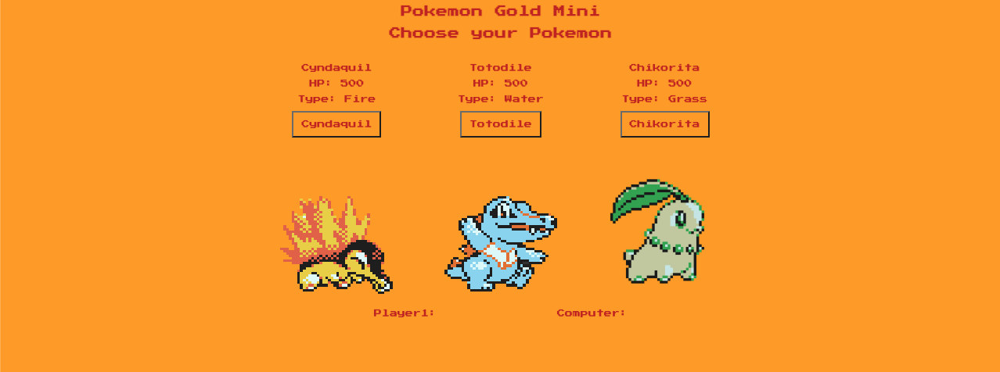

# 🌟Pokemon Gold Mini 🌟

## Yousof Wakili

[GitHub](https://github.com/ywakili18) | [Deployed](http://yousofwpokemongoldmini.surge.sh/) | [ Portfolio](youseffect.com)

## 🌟Technologies🌟

---

---

**MVP**

- [x] 3 starter pokemon
- [x] OOP principles (pokemon class, object to hold data)
- [x] Utlize flexbox or grid
- [x] Event listener
- [x] Add game logic, include sprites
- [x] Check winner function
- [x] Deploy on surge
- [x] CSS

---

## **Getting Started** ✅

To create a game like this will require the following:

1. Creating three pokemon (and too add any new pokemon in future) utilizing OOP basics (Classes and objects)
2. Both Pokemon having unique moves (having random damage points associated)
3. Pokemon having unique attributes (Name, image of pokemon, Hit Points/ Health Points, type(i.e fire/water/electric etc))
4. Adding game start/restart button, Choosing between which pokemon & what move user wants to pick.
5. Checking for winner

---

## **Game Logic** 🤔

1. Utilizing objects/classes, can create two unique Pokemon containing data about each one.
2. Adding if/else conditional to check for winner/starting game/restarting game. This will also be the case for when user chooses to attack and each attack will take away from current HP and display current HP points based upon last attack.
3. Event listeners will be utilized to pick between Each pokemon, move, and game start.
4. Different functions will be created for each different game logic (gamestart, checking winner)
5. May utilize an array to contain both moves.
6. After game logic is finished, then will include CSS styling (using grid) and adding any HTML structuring.

**_Trello Board listed for planning_**

#### [Trello Board](https://trello.com/b/7Ojd8AR1/pokemon-mini)

**_Future Plans_**

- [ ] Add more pokemon to choose from
- [ ] Include more then one move(include status moves)
- [ ] Type chart
      **_Credits_**

[Font Used : "Press Start 2P" by CodeMan38](https://fonts.google.com/specimen/Press+Start+2P)
